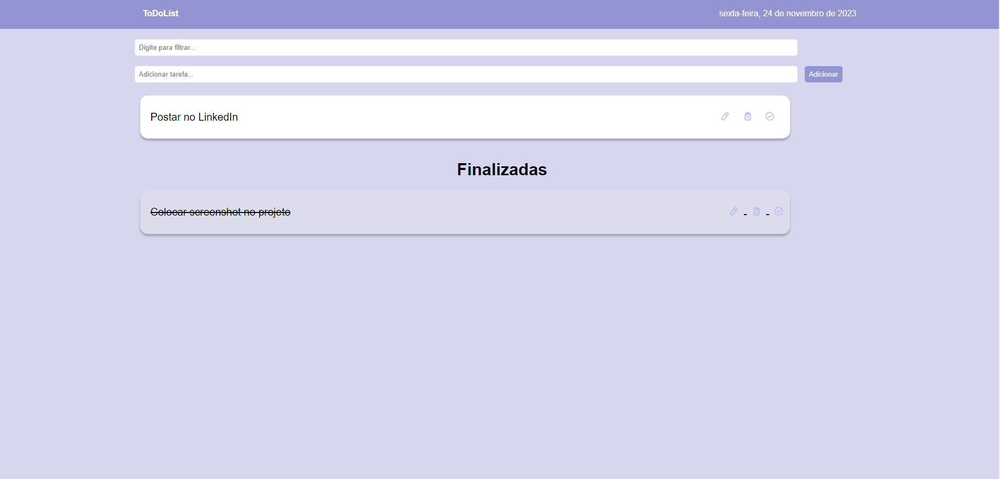

# ToDo List

Este é um projeto simples de lista de tarefas (ToDo List) desenvolvido em HTML, CSS e JavaScript. Ele permite que você adicione, remova, edite e filtre tarefas. As tarefas podem ser marcadas como concluídas e movidas para a seção "Finalizadas".

## Funcionalidades

- Adicionar tarefas.
- Remover tarefas.
- Editar tarefas.
- Marcar tarefas como concluídas.
- Filtrar tarefas.

## Screenshots

## Social

💼[Linkedin](https://www.linkedin.com/in/douglas-queiroz/)  
💁‍♂️[Instagram](https://www.instagram.com/douglas.liman/)

## Licença

[MIT](https://choosealicense.com/licenses/mit/)